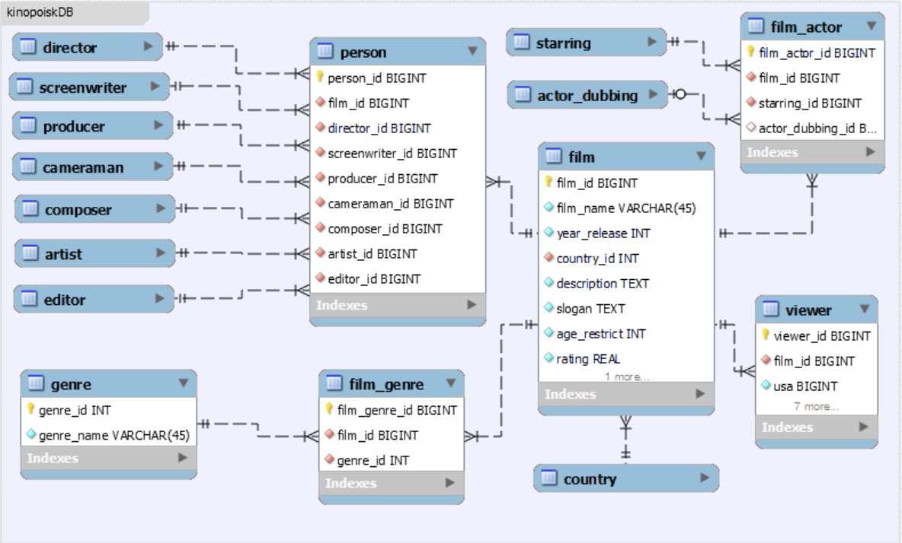

# kinopoiskDB
### Task
Спроектирвоать базу для хранения фильмов. 
База должна давать возможность хранить информацию как на странице:
https://www.kinopoisk.ru/film/435/
- Для хранения художников, композиторов, монтажеров и пр используем одну таблицу person 
-- упрощаем и чтобы не плодить кучу таблиц только в главных ролях и роли дублировали будут иметь (film-person) связь многие ко многим. 
-- для остальных ставим связь один ко многим (поэтому в графе сценарий у нас для фильма будет всего один сценарист [например, только Фрэнк Дарабонт], аналогично и по другим полям персон) 
- Жанры также хранятся в отдельной таблице исвязываются далее с фильмами.
- Зрители по странам тоже в отдельной таблице (флажки можно не хранить).

#### EER diagram предполагаемой БД. 

Для создания базы данных: 
1. CREATE DATABASE kinopoiskDB;

2. Запуск скрипта kinopoiskDB_CREATE.sql

3. Проверка запросов kinopoiskDB_SELECT.sql.
